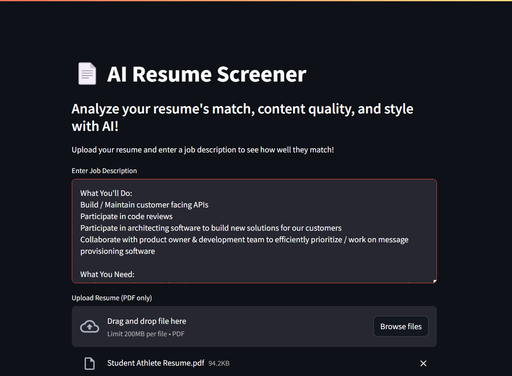
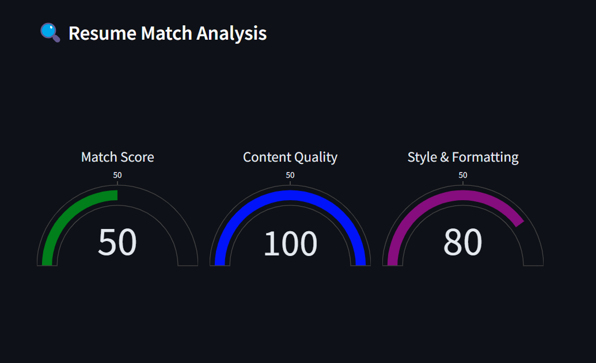
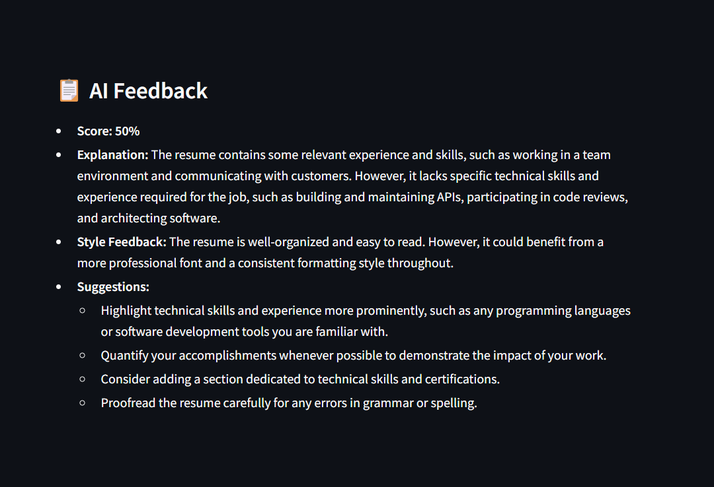

# 📄 ResumeRank AI - AI-Powered Resume Screener

## 🚀 Overview
**ResumeRank AI** is an AI-powered resume screening tool that analyzes resumes against job descriptions and provides a **match score**, **content quality analysis**, and **style evaluation**. It helps job seekers and recruiters instantly assess resume effectiveness using **Google Gemini AI**.




---

## 🎯 Features
- ✅ **Job Match Score** – AI evaluates how well a resume aligns with a job description
- ✅ **Grammar & Spelling Analysis** – Checks content quality for errors
- ✅ **Style & Formatting Feedback** – Reviews structure, readability, and layout
- ✅ **Circular Progress Bars** – Visual representation of resume scores
- ✅ **Interactive UI** – Built with Streamlit for a seamless experience

---

## 🛠️ Tech Stack
- **Python** – Core programming language
- **Streamlit** – Frontend framework for building interactive UI
- **Google Gemini AI** – AI model for resume evaluation
- **PyPDF2** – Extract text from PDF resumes
- **TextBlob** – Analyzes spelling and grammar
- **Plotly** – Creates circular progress bars
- **dotenv** – Securely loads API keys

---

## 🔧 Installation & Setup

### 1️⃣ Clone the Repository
```sh
git clone https://github.com/your-repo/resumerank-ai.git
cd resumerank-ai
```
### 2️⃣ Create a Virtual Environment
```sh
python -m venv venv
source venv/bin/activate  # On Windows: venv\Scripts\activate
```
### 3️⃣ Install Dependencies
```sh
Copy
Edit
pip install -r requirements.txt
```
### 4️⃣ Set Up API Key
Create a .env file and add your Google Gemini API key:

```sh

GEMINI_API_KEY=your-google-gemini-api-key
```
### 5️⃣ Run the App
```sh
streamlit run app.py
```
